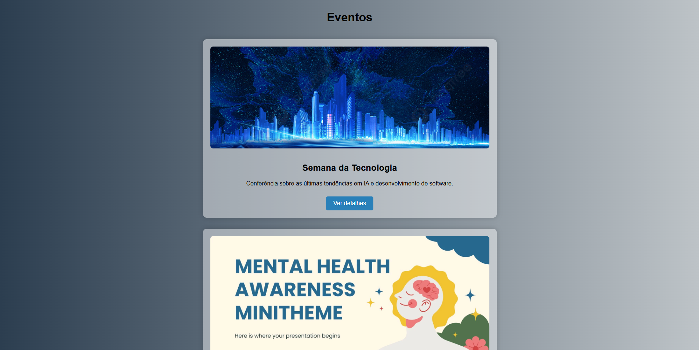
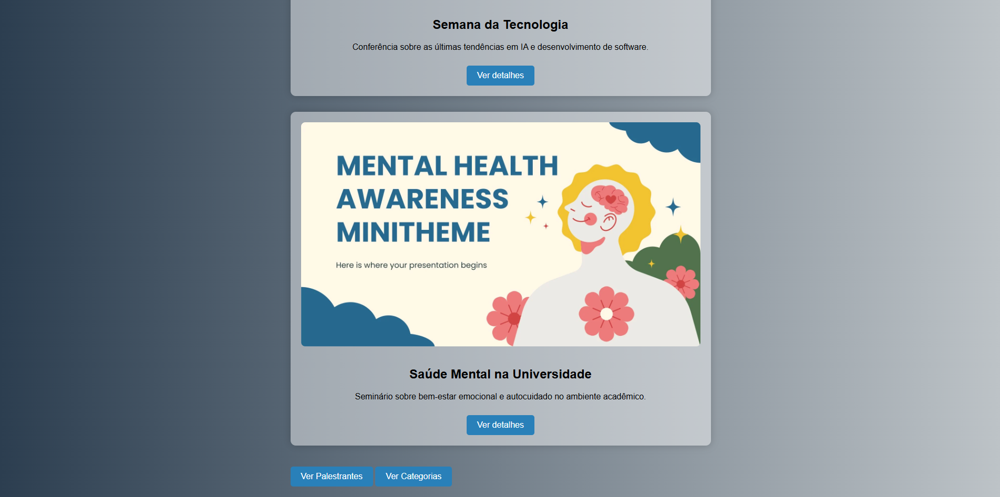
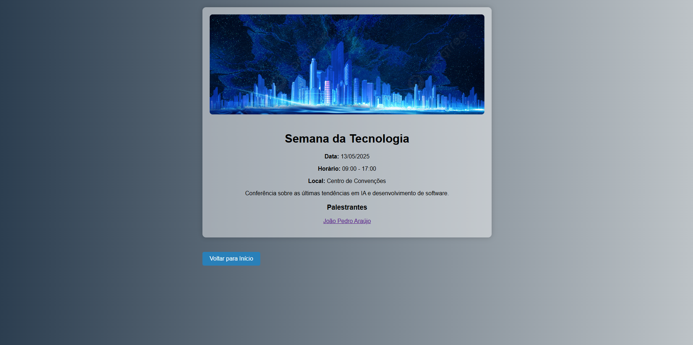
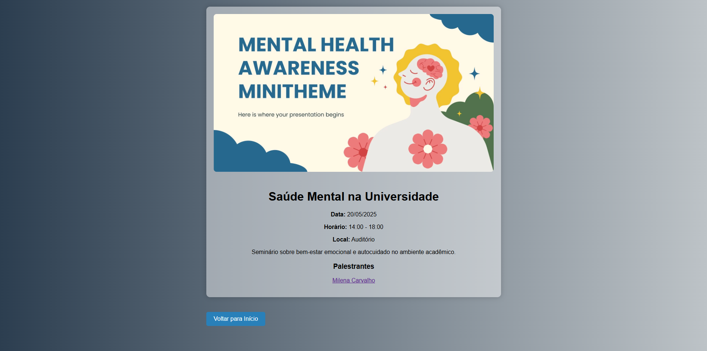
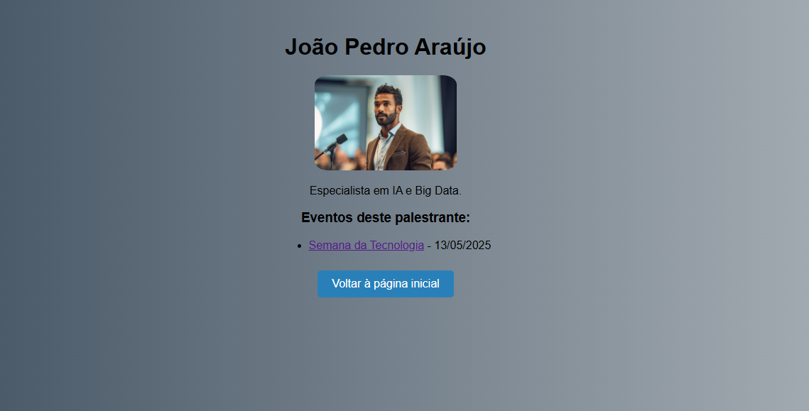

# Sistema de Eventos com Flask

Projeto desenvolvido durante aulas de Flask na faculdade de Engenharia de Software. É um sistema web simples para exibição de eventos e palestrantes, utilizando rotas dinâmicas, templates e páginas HTML com CSS customizado.

ℹ️ Observações
Projeto proposto em aula, com desenvolvimento orientado pelo professor.

Algumas partes foram ajustadas e organizadas por mim para fins de aprendizado e prática.

## 🚀 Tecnologias utilizadas

- Python 3
- Flask
- HTML5
- CSS3
- Jinja2 (templating)
- Ambiente virtual (`venv`)

## 💻 Funcionalidades

- Listagem de eventos com banner, data e descrição
- Detalhes de cada evento
- Visualização de palestrantes
- Página com detalhes dos palestrantes e os eventos que participam
- Filtro de eventos por categoria

## 🖼️ Imagens

### Prints das telas principais:

#### - Página inicial com eventos

#### - Página de detalhes do evento

#### - Tela de palestrantes

## 🛠️ Como executar o projeto

1. Clone o repositório:
bash
git clone https://github.com/seu-usuario/seu-repo.git
cd seu-repo

Linux/Mac:
python3 -m venv venv
source venv/bin/activate

Windows:
python -m venv venv
venv\Scripts\activate

pip install flask
python app.py ou flask run

Acesse no navegador:
http://localhost:5000
